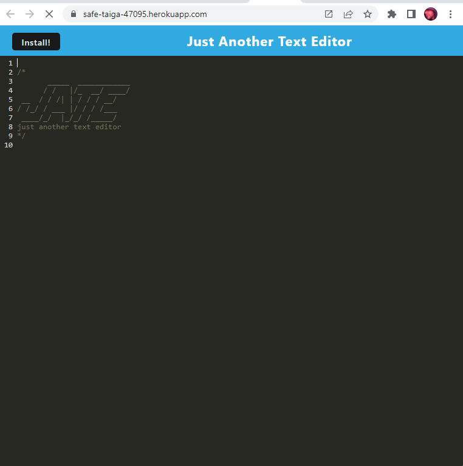

# **text-editorPWA**

## Description

    Just Another Text Editor

## Table of Contents

- [Description](#description)
- [Installation](#installation)
- [Usage](#usage)
- [License](#license)
- [Demonstration](#demo)
- [Questions/Contact](#questions)

## Installation

    clone the repo then use 'npm install' in the command line to install dependencies

## Usage

    text editor app that can be installed and has offline functionality via service worker

## License

    MIT

## Demo

    Example images and live page

## Questions

    Reach me and all of my projects through Github @
    https://github.com/apom311
    for further questions email me directly @
    frost_bird@hotmail.com
